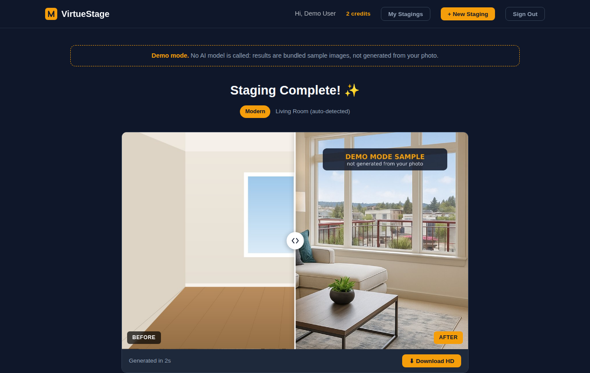
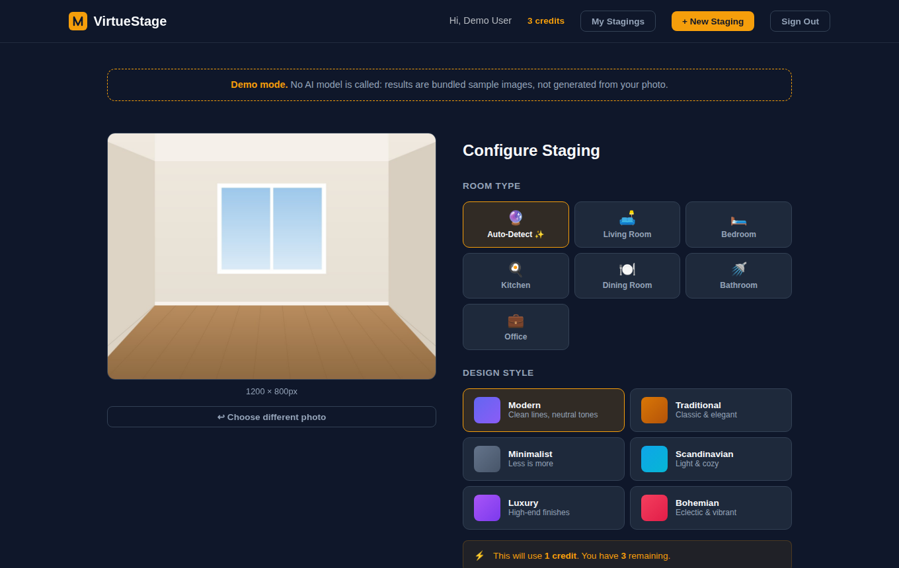
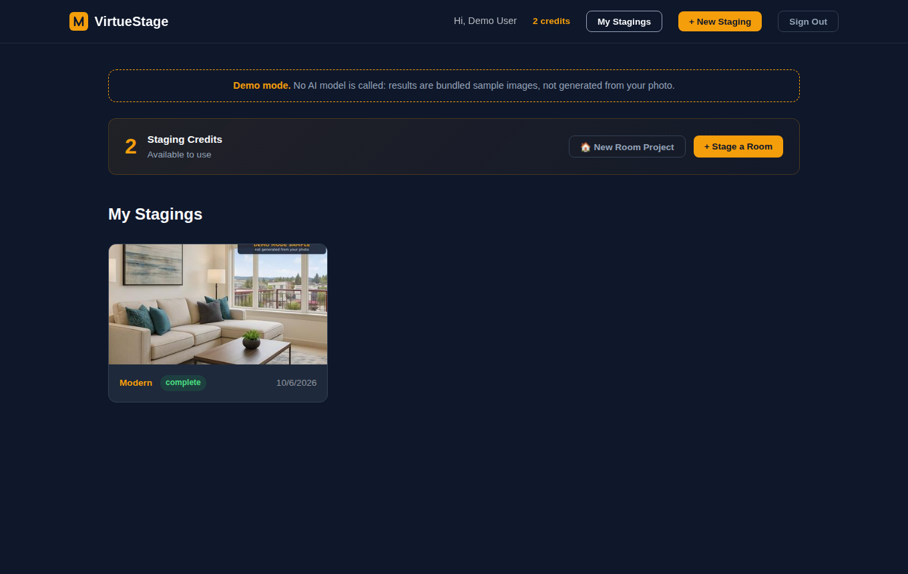

# VirtueStage

AI virtual staging for real estate photos: upload a photo of an empty room, pick a design style, and get back a furnished version.
Aimed at listing agents who want staged photos without paying for physical staging.



## What it does

1. **Sign up** and get 3 free staging credits (email + password, JWT auth).
2. **Upload** a room photo, choose a room type (or auto-detect) and one of six styles:
   modern, traditional, minimalist, scandinavian, luxury, bohemian.
3. The backend builds a detailed, style- and room-specific prompt (materials, seating, accents,
   decor and a fixed "furniture manifest") and sends the photo to Google Gemini's image model,
   asking it to add furniture while keeping walls, floors, windows and lighting unchanged.
4. **Compare** before and after with a drag slider, download the result, or re-stage the same
   photo in another style. A credit is only deducted when a job succeeds.
5. **Multi-angle projects**: stage a hero shot first, then upload other angles of the same room;
   each is staged with the hero result as a reference image so the furniture stays consistent.

| Configure | Dashboard |
|---|---|
|  |  |

Screenshots were taken from the running app in **demo mode**, where the "after" image is a bundled
sample (labeled as such) rather than a real generation from the uploaded photo.

## Architecture

```
website/   React 19 + Vite SPA (landing page, auth, dashboard, upload/compare UI)
backend/   Express 5 API: auth (bcrypt + JWT), credits, uploads (multer), thumbnails (sharp),
           SQLite via better-sqlite3; serves the built SPA from backend/public in production
engine/    Python scripts the backend spawns per job:
             virtual_stager.py  Gemini image generation (OpenAI gpt-image-1 optional, CLI only)
             detect_room.py     Gemini vision room-type classification
```

Request flow: `POST /api/staging/upload` stores the photo, inserts a `processing` job and spawns
`engine/virtual_stager.py`. The frontend polls `/api/staging/status/:jobId`; when the engine exits,
the backend moves the output into `data/results/<user>/`, makes thumbnails, marks the job
`complete` and deducts one credit. Image URLs in API responses carry a short-lived, image-only token
so plain `` tags can load them.

## Running locally

Requirements: Node.js 22.9+. For real staging also Python 3.10+ and a Gemini API key.

### Demo mode (no API key)

```bash
cd backend && npm install
cd ../website && npm install && npm run build && rm -rf ../backend/public && cp -r dist ../backend/public
cd ../backend && STAGING_MODE=demo JWT_SECRET=dev npm start
# open http://localhost:3099
```

In demo mode no model is called and Python is not needed. Each job waits ~1.5 s and returns a
bundled sample image with a "DEMO MODE SAMPLE" label, and the dashboard shows a demo notice.
Auth, credits, uploads, thumbnails, re-staging and downloads all run for real.

### Real staging with Gemini

```bash
pip install -r engine/requirements.txt
cp backend/.env.example backend/.env   # set STAGING_MODE=gemini, GEMINI_API_KEY, JWT_SECRET
cd backend && npm start                # API on :3099
cd website && npm run dev              # Vite dev server on :5173, proxies /api to :3099
```

### Docker / Railway

`Dockerfile` builds one image with the API, the built frontend and the Python engine;
`railway.json` points Railway at it and health-checks `/api/health`. Set `JWT_SECRET`,
`GEMINI_API_KEY` (or `STAGING_MODE=demo`) and mount a volume at `DATA_DIR` (default
`/app/backend/data`) so the database and images survive redeploys. `deploy.sh` does the same
build without Docker.

## Environment variables (backend)

| Variable | Default | Purpose |
|---|---|---|
| `STAGING_MODE` | `gemini` | `demo` returns bundled samples instead of calling the engine |
| `GEMINI_API_KEY` | | Required for `gemini` mode (`GOOGLE_API_KEY` also accepted) |
| `GEMINI_IMAGE_MODEL` | `gemini-flash` | `gemini-flash` (`gemini-2.5-flash-image`), `gemini-pro`, or a full model id |
| `JWT_SECRET` | random per start | Set it, or every restart logs all users out |
| `PORT` | `3099` | HTTP port |
| `DATA_DIR` | `backend/data` | SQLite DB, uploads, results, thumbnails |
| `PYTHON_BIN` | `python3` | Interpreter used to run the engine |
| `DEMO_DELAY_MS` | `1500` | Simulated processing time in demo mode |

See `backend/.env.example`.

## Scripts and tests

| Where | Command | What |
|---|---|---|
| `backend/` | `npm start` / `npm run demo` | Run the API (loads `backend/.env` if present) |
| `backend/` | `npm test` | node:test + supertest: auth, credits, upload/restage flow, access control (demo engine, temp DB) |
| `website/` | `npm run dev` / `npm run build` / `npm run lint` | Vite dev server, production build, ESLint |

CI (`.github/workflows/ci.yml`) runs the backend tests, the website lint and build, and a Python
syntax check of the engine on every push and pull request.

## Status

Working: auth, free credits, single-photo staging, auto room detection, re-staging, downloads,
multi-angle projects, demo mode, Docker build config.

Not implemented yet:
- **Payments.** The Pro plan on the pricing page is marked "coming soon"; there is no Stripe or
  other billing integration, and `plan` is always `free`.
- Watermarking, password reset, email verification, and rate limiting beyond 3 concurrent jobs per user.
- Image storage is local disk; there is no object storage or cleanup policy.

Early business planning notes (market research, pricing ideas) live in `docs/planning/` and are
not product metrics.

## License

No license has been chosen yet, so all rights are reserved by the author.
